== Getting started

=== Installation and configuration

Simply extract the plugin archive to the `Plugins/Modio` directory of your project.  

Enable the plugin in the Unreal Engine settings:

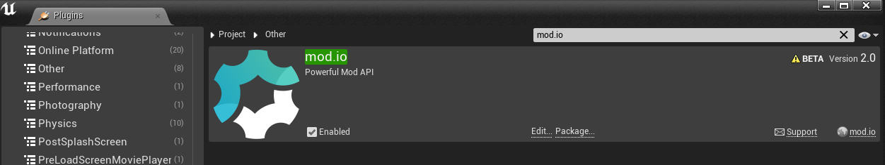

Once this is done, you can configure the plugin and get started.

'''

=== Configuration

The plugin requires some configuration information to behave correctly. You can access the configuration settings in the Project Settings window:

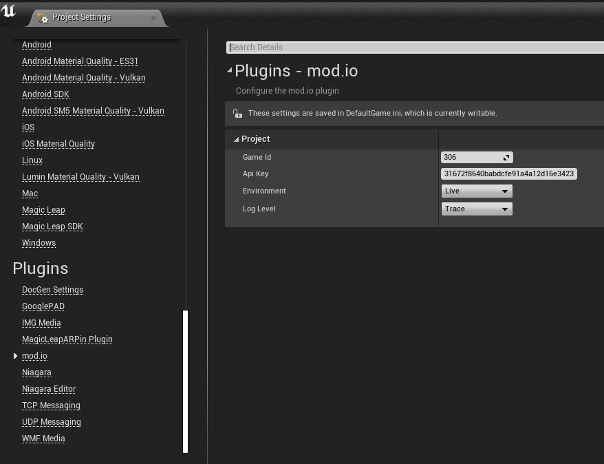

The settings have the following parameters:

[.stretch,stripes=odd,frame=none, cols="25%,~"]
|===
|[.paramname]#Game Id#|Your mod.io-provided Game Id for the target environment (Live, or Test)
|[.paramname]#API Key#|Your mod.io-provided Game Id for the target environment (Live, or Test)
|[.paramname]#Environment#|Are you targeting the production/live environment or the private/test environment?
|[.paramname]#Log Level#|The default logging level to use. Messages with a lower log level will be silently discarded.

|===

'''

=== Plugin structure and concepts

[[modio_subsystem,ModioSubsystem]]
==== ModioSubsystem
The mod.io UE4 plugin consumes our native SDK internally, and it's public API is similar. Where the native SDK exposes a number of free functions within the `Modio` namespace, for ease of integration we have wrapped those in a https://docs.unrealengine.com/4.26/en-US/ProgrammingAndScripting/Subsystems/[Subsystem].

The <<ModioSubsystem,ModioSubsystem's>> lifetime is automatically managed by the engine for you, and provides a convenient way to access the plugin functionality, which is broadly grouped into the following categories:

* Plugin management (initialization, teardown, event loop)
* User authentication
* Mod browsing and querying
* Mod management (subscription, unsubscription, and installation)

==== Value objects
All data returned by the plugin is presented using a small set of USTRUCTs, containing information such as:

* Details for mods that are available for installation
* Progress information about mods being installed
* Details, and load paths, for installed mods

As structs, these are value types, so if you want to hold onto them once you've shut down the plugin you can do so, and they do not expose any methods that 'talk back' to the Subsystem, so their methods are safe to call.
This allows you, for instance, to initialize the plugin, query the installed mods, and retain that list even after shutting down the plugin again so you can stop running the plugin's event loop. 

==== UTF-8 guarantees

The plugin uses UTF8 for all strings, as does the mod.io REST API. 

==== Thread-safety guarantees

[caption=2.0.0-alpha] 
NOTE: The mod.io plugin is currently NOT thread-safe. All calls to plugin functions should be made on the game thread.

[caption=FUTURE RELEASE] 
NOTE: The mod.io plugin will be thread-safe for all calls EXCEPT <<RunPendingHandlers>>. See <<Maintaining the plugin event loop>> below for further information. 

NOTE: The plugin event loop, any internal event handlers, and all callbacks you provide to the mod.io plugin, will be run on the thread invoking <<RunPendingHandlers>>.

==== Non-blocking, asynchronous interface

The plugin communicates with the mod.io servers, the filesystem on the device you're using, and platform-provided services for authentication. All of these may not return results immediately, so many functions provided by the ModioSubsystem are non-blocking and asynchronous.

NOTE: All async methods in the public API end with the suffix `Async`. 

===== Callback conventions
All of these asynchronous methods take a delegate as an argument, which will be invoked *exactly once* with the results of the requested operation. 
Every async callback takes a <<ModioErrorCode>> as its first parameter, with any optional results wrapped in `TOptional` so that you can easily check if a result is valid or not. 

Any return values provided to your callback are passed-by-value - the plugin doesn't expect you to have to call `release` or otherwise free up resources given to you. 

NOTE: Even if the plugin is shut down while asynchronous operations are in-flight, your delegates will still be invoked *exactly once*. In this instance, the <<ModioErrorCode>> the delegate receives will indicate a cancellation state, and you should check for this as part of your error handling in your delegates.

===== Maintaining the plugin event loop

In order to provide a non-blocking implementation, the plugin operates an internal event loop. This event loop, will only ever run on the thread which calls <<RunPendingHandlers>>.

NOTE: This means that if you stop calling <<RunPendingHandlers>>, any pending asynchronous API methods you have called will not complete and their associated callbacks will not be invoked, nor will the internal data allocated for those operations be freed.

==== User Sessions

The mod.io plugin runs on a per-platform-user basis. If you are using the plugin on a platform that requires user switching support, it is a requirement that you call <<K2_ShutdownAsync>> and then re-initialize the plugin with <<K2_InitializeAsync>> with the new platform-specific user handle.

==== Error handling

Many functions in the plugin interface either return, or provide as the first parameter to your delegate, a <<ModioErrorCode>> value. This is essentially an opaque wrapper around a numeric error code with a category and an associated string message. 

The plugin doesn't attempt to predict what your error-handling logic or requirements are: instead, we return the error code to you so you can decide what to do. For instance, if you call a function and receive an error code matching a network error condition, do you want to close down the plugin? Retry again according to custom back-off logic? That decision is left to the consuming application. 

For more details on the error codes and how to inspect their values, please see <<Plugin quick-start: Error Handling>> and <<ModioErrorCode>>.

==== Mod Data Directory

The plugin stores mods in a game-specific directory in the following directory by default:

[stripes=odd,frame=none,cols="1,^1,^1"]
|===
|Windows | Linux | OSX

|`${FolderID_Public}/mod.io` | TBD |TBD
|===

However, this value can be overridden in one of two ways:

* Globally for a system account
+
On first run of a game using the plugin, `${FOLDERID_LocalAppData}/mod.io/globalsettings.json` will be created. 
+
This JSON object contains a `RootLocalDataPath` element - changing the string here to a valid path on disk will globally redirect the mod installation directory for *ALL* games using the mod.io UE4 plugin or native SDK for the current system account. 
+
NOTE: Changing this value while the SDK is initialized is not supported and behaviour is undefined.

* Per-game for a system account   
+
Per-game settings are stored in `${FOLDERID_LocalAppData}/mod.io/${GameId}/${mod.io user string}/user.json`. 
+
*Adding* a `RootLocalDataPath` element to this file will redirect the mod installation directory for this specific game only, for the current system account. Removing this value will cause the game to revert back to the global value in `globalsettings.json`.

'''

=== Plugin quick-start: Initialization and Teardown

As mentioned in <<Maintaining the plugin event loop>>, the plugin's internal event loop requires care and attention in the form of <<RunPendingHandlers>>.
For best performance it should be called at least once per frame, so it should either go into your project's main loop or into a `tick`-style function on an appropriate controller/manager object. 

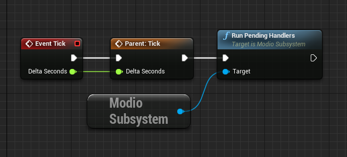

When you are ready to initialize the plugin for the current user, you'll need to call <<K2_InitializeAsync>>, passing in an instance of `FModioInitializeOptions`, and a delegate so you know when the plugin is initialized correctly. 

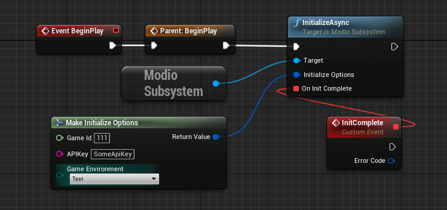

If you have configured your game's API Key, ID and environment via the Plugin Settings window as in <<Configuration>>, you can use the convenience function <<Get Project Initialize Options>>:

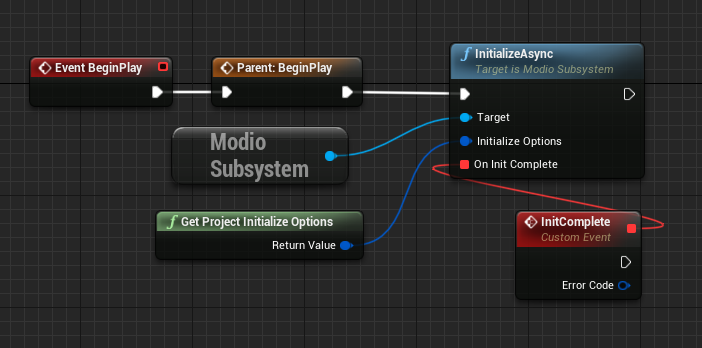

.Notes
* The error-handling in this sample has been omitted. See <<Plugin quick-start: Error Handling>> for more information on error handling. 

Doing the reverse and shutting down the plugin is equally simple:

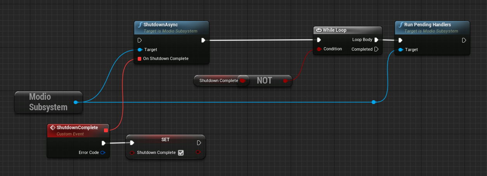

.Notes
* You will need to continue to call <<RunPendingHandlers>> while the async shutdown is in progress to allow for intermediate handlers to finish running, and for your in-flight calls to return with an error code indicating cancellation.

'''

=== Plugin quick-start: User Authentication

Mod.io provides two ways for users to create an account to use the service: email authentication, and single sign on (SSO) through an external authentication partner. The flow for these is slightly different.

==== Email authentication

Mod.io allows users to create an account on the mod.io website using an email address. Once the user has accepted the mod.io Terms of Use and created an account, they can use that email address to log in and access mod.io services in your game. 

Email authentication involves:
    1. Submitting the user's email address
    2. The user retrieving the one-time code mod.io sends to that address (externally to your application)
    3. Submitting the code provided by the user

===== Submitting an email address

To request an email authentication code be sent to a user's email address, use the <<K2_RequestEmailAuthCodeAsync>> node.

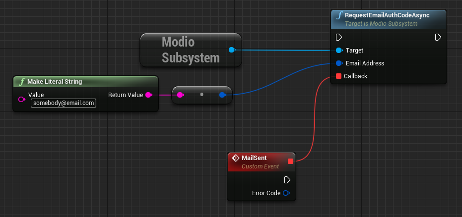

Once this is done, prompt the user to check their email address and provide them with a way to enter the code that was sent to them. 

This code can then be sent to the mod.io server to finalize the user's authentication. 

===== Submitting an email authentication code

Submitting an email authentication code is very similar to the process for requesting the code, and is done by calling <<K2_AuthenticateUserEmailAsync>>.

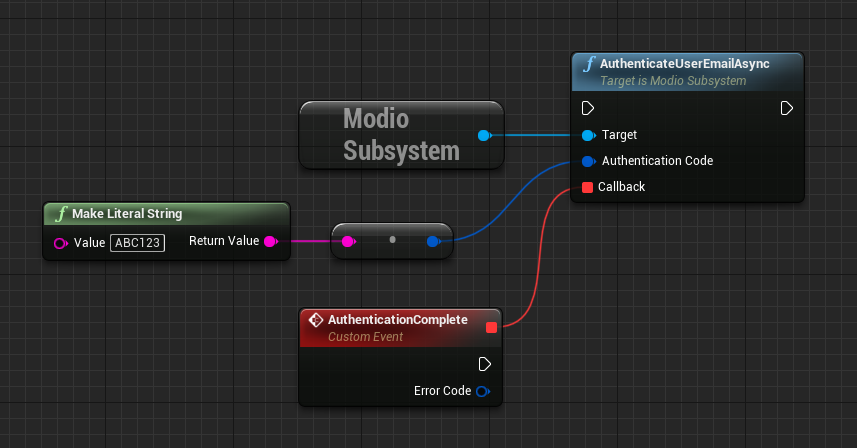

Once this completes successfully, the user is authenticated and you can then manage the user's subscriptions. 

==== SSO/External authentication

Mod.io features single sign on authentication from a number of external providers. This currently includes:

    * Xbox Live
	* Steam
    * GoG
    * Itch
    * Switch
    * Discord

In order to use SSO with mod.io, a user must have accepted the mod.io Terms of Use in order to create an account. 

This means the external authentication flow is the following:

    1. Call <<K2_AuthenticateUserExternalAsync>> , passing in any provider-specific parameters, setting `AuthenticationParams::bUserHasAcceptedTerms` to false, and indicating which authentication provider you wish to use
    2. Check the error code in the callback - if it indicates the user has not yet created an account or accepted the terms, call <<K2_GetTermsOfUseAsync>> and display the provided information to your user
    3. If the user clicks the OK/affirmative button on your screen displaying the terms of use, repeat the call in step 1 but setting `AuthenticationParams::bUserHasAcceptedTerms` to *true*
    4. Check the error code in the callback - a false-y error code indicates that authentication was successful, and users can now install and manage mods and subscriptions.

Here's what steps 1 and 2 might look like in Blueprint:

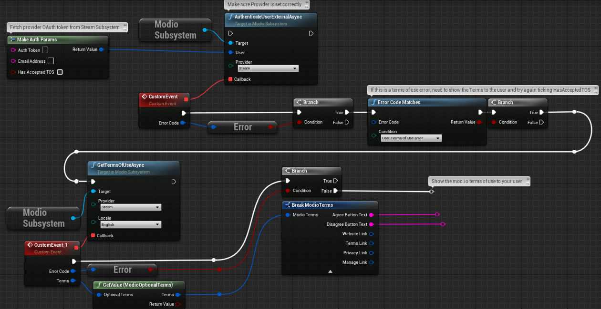

'''

=== Plugin quick-start: Browsing available mods

Now that you've followed the instructions in <<Plugin quick-start: Initialization and Teardown>> you can begin to query the available mods for information you can display to your end users. The primary way this is done is through <<K2_ListAllModsAsync>>.

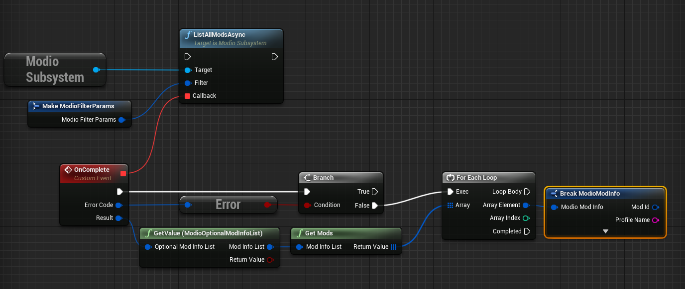

You'll note that <<K2_ListAllModsAsync>> takes a <<ModioFilterParams>> object as its first parameter. The default state of this object is set to ask for the first 100 results (the maximum number returnable in a query), sorting by mod ID.

To search for a specific query string, sort in a different order, or combine different filters, you can use a <<ModioFilterParams>> object like this:

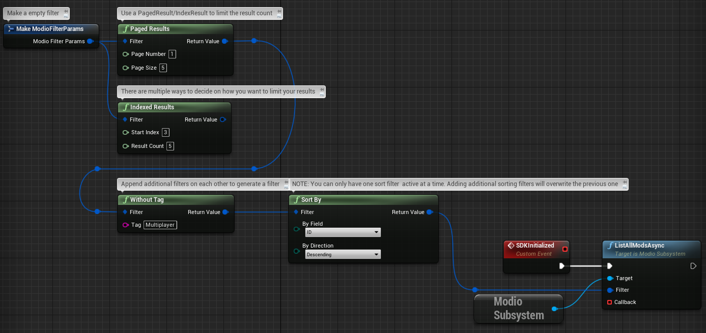

'''

=== Plugin quick-start: Mod subscriptions and management

So you've shown the user some mods based on a query they've submitted through your UI, and the user has picked one that they'd like to install. How do you begin the installation process, and once the mod is installed how do you know what files to be loading into memory?

==== Mod subscriptions

A user indicates that they want to have a mod installed by 'subscribing' to it. Subscriptions are stored on the mod.io servers and associated to a user's mod.io account. 

When a user 'unsubscribes' to a mod, they're indicating they'd like to have that mod uninstalled from any device they're logged in on. 

The API for managing subscriptions is simple and consists of a call to either <<K2_SubscribeToModAsync>> or <<K2_UnsubscribeFromModAsync>> with the ID of the mod in question and a delegate to receive the status of the request:

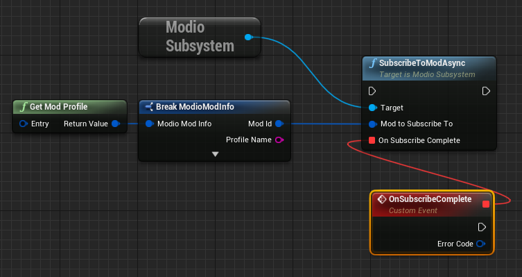

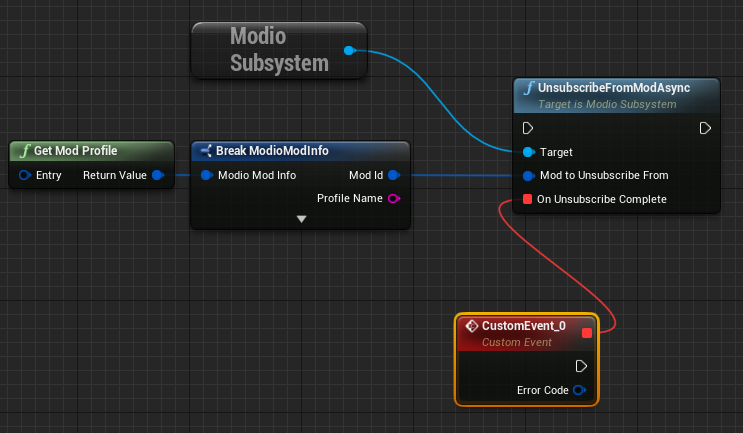

===== External subscription changes

Because the mod.io service is available as a website as well as integration within your applications, users can manage their subscriptions (and therefore installations) outside of your application. This means that we need to be able to query the server for any external subscription changes. To do this, you will need to use <<K2_FetchExternalUpdatesAsync>> to synchronise the server state with the plugin's local subscriptions:

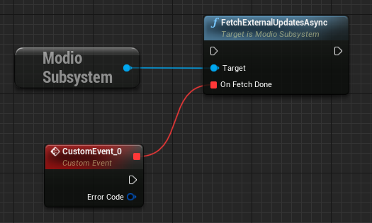

NOTE: You should call <<K2_FetchExternalUpdatesAsync>> sparingly, at times you want to ensure that the state is up-to-date. Alternatively, we recommend calling it based on user input such as a button in your UI, so you don't make spurious update checks. 

===== Checking the user subscription list

In order to see which mods the user has subscribed to, call <<QueryUserSubscriptions>> to retrieve a collection of <<ModioModCollectionEntry>> objects, one for each subscribed mod. 
Each of these objects contains the mod's state, profile information, ID, and other data, suitable for showing users a list of their subscriptions.

NOTE: This collection includes mods that are still in the process of being installed! Make sure to check the result of <<GetModState>> before trying to load files from the mods in this collection, or alternatively use <<QueryUserInstallations>> as described in <<Retrieving mod directory paths for loading>>.

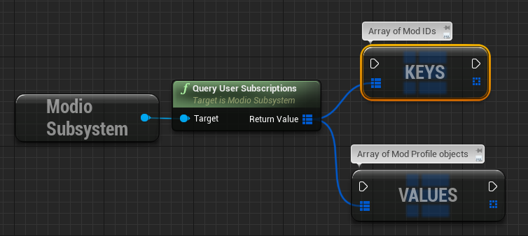

==== Installation management, mod paths

So a subscription marks a mod as requiring installation, and an unsubscription indicates uninstallation, but how do you actually control when the plugin *does* those things? After all, you don't want a mod to be uninstalled after your main program has loaded those files into memory, locking them from deletion. Likewise, you probably don't want to be using networking or processor resources during gameplay for downloading mods. In order to give you control over when these processes occur, without forcing you to shut down the plugin entirely, you can call <<K2_EnableModManagement>> and <<DisableModManagement>>.

In order to display a notification to your users when a mod is finished installing or updating, <<K2_EnableModManagement>> asks you to provide it with a callback. Because <<K2_EnableModManagement>> is not an async function (ie it doesn't end with *Async), the callback operates differently to asynchronous result callbacks you use elsewhere in the plugin. A callback given to this function will be held by the plugin until a corresponding call to <<DisableModManagement>> or <<K2_ShutdownAsync>>, and the callback will be invoked every time a mod is automatically installed, updated, or uninstalled by the plugin's internal event loop.

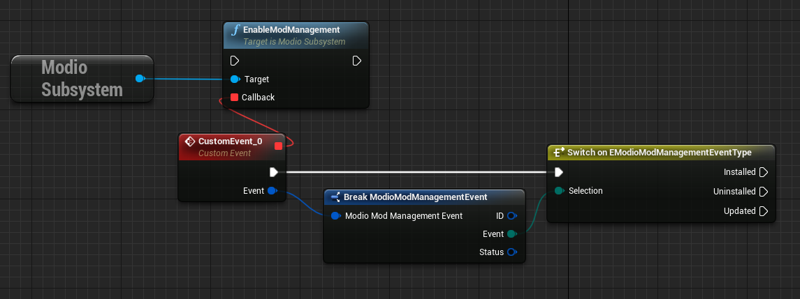

While mod management is enabled, the plugin assumes that it has the ability to make changes to the filesystem, including deleting mods that the user has no longer subscribed to. As a result you should make sure that you don't have any open handles to files inside the mod directories when you call <<K2_EnableModManagement>>.

When you want to be able to freely open files in the mod directories, call <<DisableModManagement>> to tell the plugin to finish the current operation but not continue any others. 

Call <<IsModManagementBusy>> to see if mod management is currently updating, installing, or uninstalling a mod. 

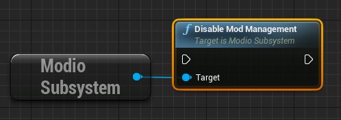

===== Retrieving mod directory paths for loading

So now we have the user picking mods and marking them for installation, we're enabling mod management at a point where we don't mind the plugin changing the filesystem, and mods are being installed by the plugin, we now need to know where they are on disk, otherwise you can't load them into your game!

The easiest way to do this is by using <<QueryUserInstallations>>. This function allows you to specify if you want to include outdated mods or not, and will return a collection of <<ModioModCollectionEntry>> objects that you can query for folder paths you can use to load files into your title. 

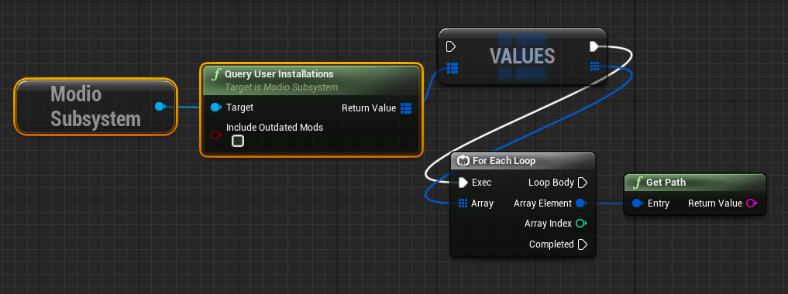

'''

=== Plugin quick-start: Error Handling

NOTE: Error handling in Blueprints is still undergoing improvement. Please let us know if you have any feedback or suggestions for improving it!

Many functions in the plugin, especially asynchronous functions either return a Modio::ErrorCode, or else invoke your passed-in callback with a Modio::ErrorCode as the first parameter.

==== Checking for errors

You can check if a ModioErrorCode represents a success or failure by using the `IsError` node. If the code returns true, then it represents an error.

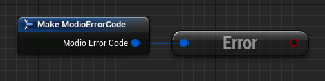

==== Inspecting ErrorCodes more deeply

Sometimes, this information will be all that is required, just a simple 'success/fail' that you can handle. 

In many cases, however, you will want to perform some degree of inspection on an ErrorCode in order to determine specific information about that error - if nothing else, so that you can display a reason for the failure to the end user.

===== Semantic Queries

In your application, you probably don't actually need to handle different network errors in different ways, for example. The semantics of networking errors are largely 'try the function again later'.

This is where <<ErrorCodeMatches>> comes in. 

It allows you to query if the error satisfies a particular condition, such as 'does this code represent some kind of networking error', without needing to explicitly check the code against all the individual errors in the category:

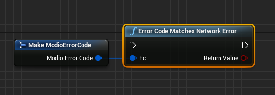

By querying if the error meets a specific condition, you can focus on handling a family of errors (in this case, network transmission errors) without needing to deal with individual errors within that grouping. No more manually checking against individual HttpError values, just a single query. 

By grouping these codes into semantic checks, it also helps you to potentially consolidate your error handling into a more limited set of generic error handlers rather than needing to deal with each potential outcome individually. 

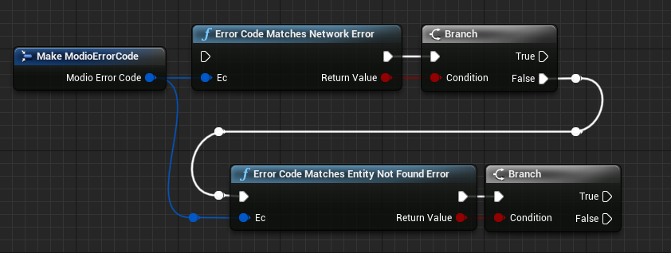

==== Parameter Validation Errors

Some of the plugin functions may return errors that indicate a parameter or data validation failure. For these cases, the plugin parses the error response from the mod.io API and stores the information about which parameters failed validation until the next network request is performed. If a plugin function returns an error which matches `EModioErrorCondition::InvalidArgsError`, you can call `GetLastValidationError` in your callback to retrieve those errors and display appropriate feedback to the end user. 

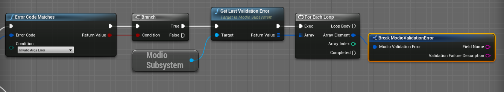

'''

